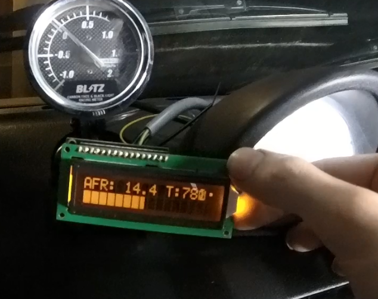
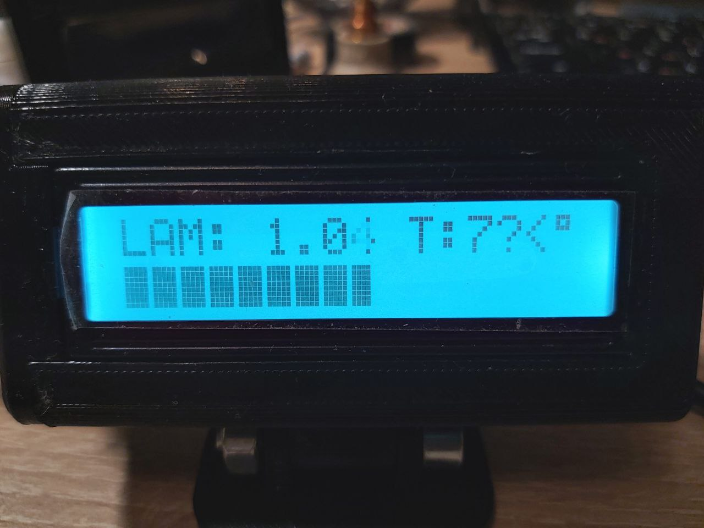
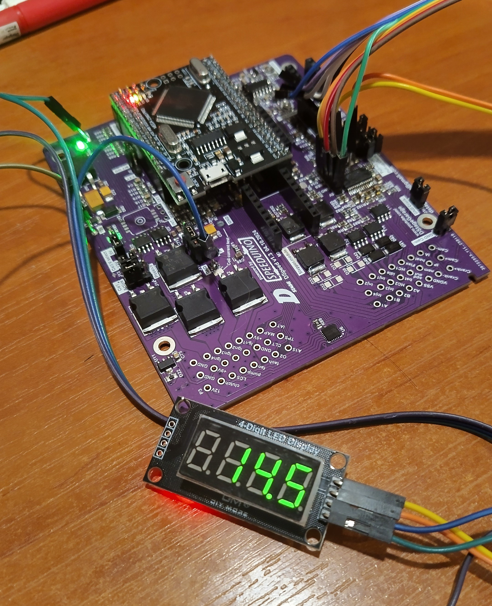
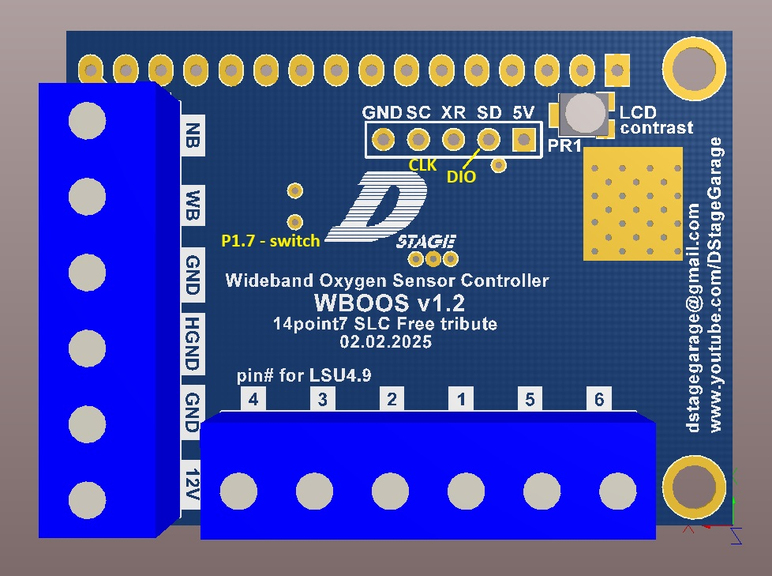

# WBOOS
DStage Wide Band Oxygen Sensor Controller, or WBOOS for short is based and a tribute to 14point7 SLC Free. From the HW perspective it has some imprevements over its inspiration such as better reference voltage source and output sigbal filters. There are also many changes in the SW such as different display modes and a possibility to use LED display instead of the standard LCD - check below.

## LED display

Since SW version v1.2 it is now possible to use 7-segment LED diplay module based on TM1637 chip. By default it is connected to SCL and SDA programming lines (CLK and DIO signals respectively). Programming interface on WBOOS also provides Power and Ground pins, so 4 wires go to the LED module in total. There is also a possibility to switch the displayed value between AFR and Lambda. By default the switch is set to P1.7 which is a free pin provided on both WBOOS and DSpeed projects. It is recomended to add an esternal 1-4,7k pull-up resistor and switch the mode by connecting the line to ground with a switch. Alternatively switching between 5V and ground is also an option. 

