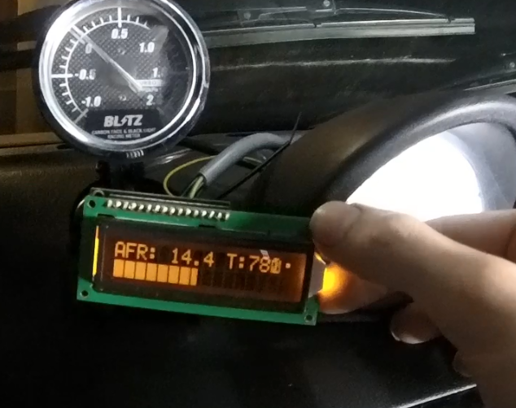
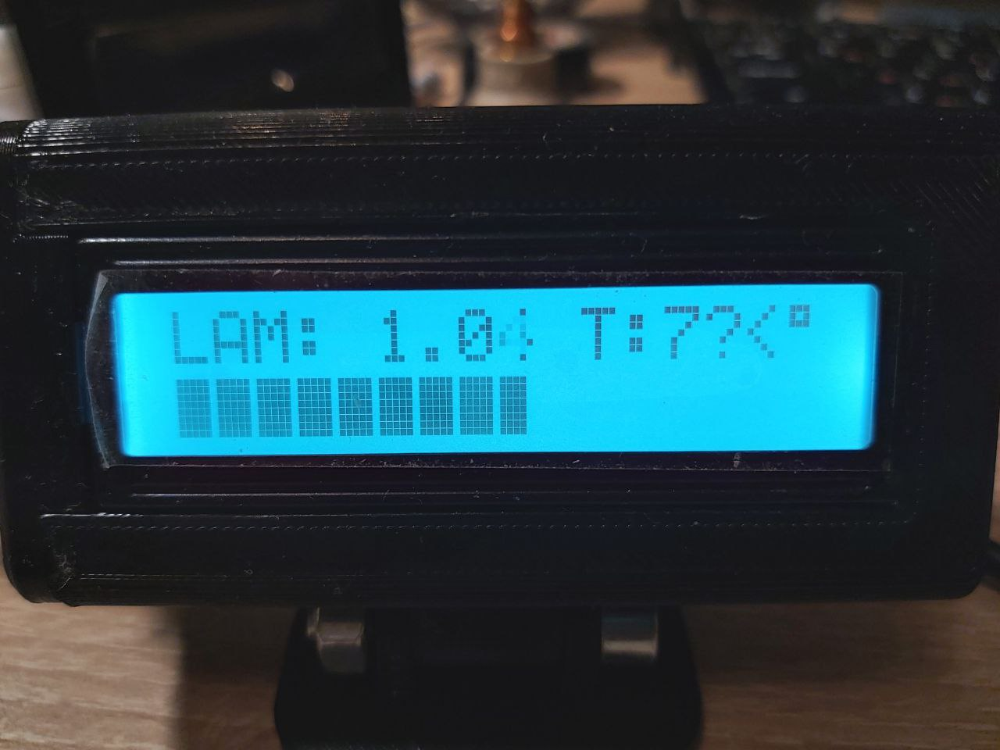

# WBOOS
Wide band oxygen sensor controller - a tribute to 14point7 SLC Free.

In SW v1.1 there is now option to compile Labda display instead of AFR. Compiled hex files are included for both variants.

